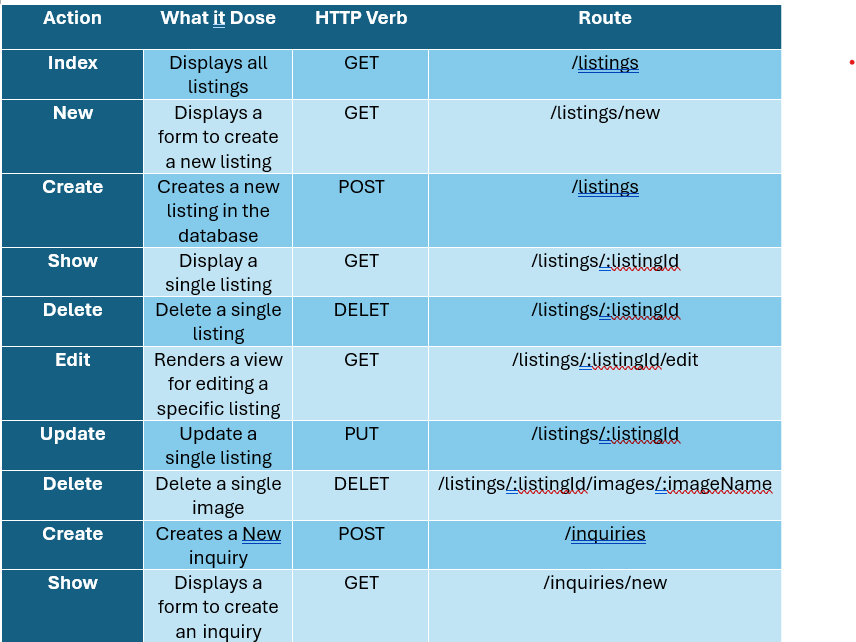

# Aurevia-website

User Story:

1- As a new user, I want to easily create a new account, so I can access personalized features such as a favorites list.

2- As a registered user, I want to log in to my account, so I can view and manage my personal data.

3- As a logged-in user, I want to log out of my account, to ensure my account stays secure when I’m not using the platform.

4- As a user, I want to view all the cars listed on the platform, so I can explore available options for purchase.

5- As a user, I want to filter or distinguish between available and sold cars, so I can focus on the cars that are still for sale.

6- As a user, I want to view detailed information about a specific car, including model, price, and specifications, so I can evaluate it properly.

7- As a user, I want to favorite a car listing, so I can easily find and review it later.

8- As a user, I want to remove cars from my favorites list, to keep it relevant to my interests.

9- As a user, I want to send an inquiry about a car, so I can contact the admin for more details.

As Admin:

1- As an admin, I want to log in securely to the platform, so I can manage the car listings.

2- As an admin, I want to add new car listings, so users can view and explore available cars for sale.

3- As an admin, I want to edit details of existing car listings, so the information remains accurate and up to date.

4- As an admin, I want to update the status of a car (available/sold), so users can see if it’s still for sale.

Linke of Wireframes: https://excalidraw.com/#json=_6x7f_DxfZTCCke_bGqix,QTYS93xMM8X7pR-WyXyZaw